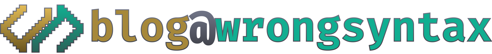

## License

The content of this website (i.e., the posts contained in `src/content/blog`) are licensed under the [CC BY 4.0 license](LICENSE).

The source code for the website is licensed under the [MIT license](LICENSE-CODE).

Assets such as the logo or favicon may not be used without prior written permission.
